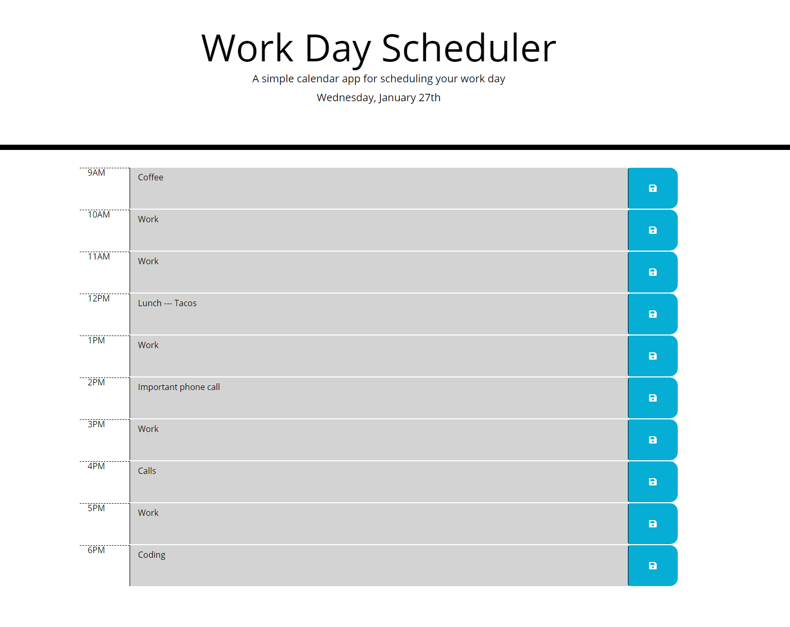

# Homework_05-Work_Day_Scheduler

Hello - This repository will serve as homework #5 submission to the UPenn LPS Coding Bootcamp. This assignment is intended to engage the student in writing JavaScript by creating a calendar app that saves notes to specific time, and can be retreieved when browser is closed. 

## Table of Contents
* [Installation](#installation)
* [Usage](#usage)
* [Credits](#credits)
* [License](#license)

## Installation

This is a simple HTML/CSS/JS webstite designed to run in a browser.  The code for this website can be viewed directly in Github. Click on  <a href = "https://mikemarino.github.io/Homework_03-Javascript_Password_Generator/">this link</a> to view the completed website in the browser.  This link is uses Github pages.

## Usage

When opened in a web browser, the user should view a website that looks like this:

## Credits
Credit for this web page design goes to the great instructures at the UPenn Coding Boot Camp.  Also the TechicalCafe youtube channel. 

## License
MIT License

Copyright (c) 2020  Mike Marino

Permission is hereby granted, free of charge, to any person obtaining a copy
of this software and associated documentation files (the "Software"), to deal
in the Software without restriction, including without limitation the rights
to use, copy, modify, merge, publish, distribute, sublicense, and/or sell
copies of the Software, and to permit persons to whom the Software is
furnished to do so, subject to the following conditions:

The above copyright notice and this permission notice shall be included in all
copies or substantial portions of the Software.

THE SOFTWARE IS PROVIDED "AS IS", WITHOUT WARRANTY OF ANY KIND, EXPRESS OR
IMPLIED, INCLUDING BUT NOT LIMITED TO THE WARRANTIES OF MERCHANTABILITY,
FITNESS FOR A PARTICULAR PURPOSE AND NONINFRINGEMENT. IN NO EVENT SHALL THE
AUTHORS OR COPYRIGHT HOLDERS BE LIABLE FOR ANY CLAIM, DAMAGES OR OTHER
LIABILITY, WHETHER IN AN ACTION OF CONTRACT, TORT OR OTHERWISE, ARISING FROM,
OUT OF OR IN CONNECTION WITH THE SOFTWARE OR THE USE OR OTHER DEALINGS IN THE
SOFTWARE.
=======